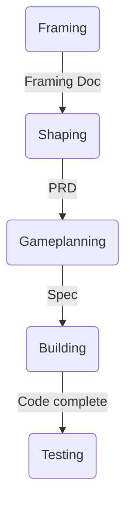

# OrangeQC Development Process (Current State)

> **Purpose:** Documents the existing development process at OrangeQC that this pipeline automates. Understanding the current process is essential context for designing the agent pipeline.

---

## The Flow



**The pipeline automates phases C through E** (Gameplanning → Building → Testing readiness). Framing and Shaping remain human-driven.

---

## Phase 1: Framing (Human-Driven, Not Automated)

**Output:** Framing Doc
**Purpose:** Define the problem space, validate the opportunity, establish solution direction.

A framing doc answers "Why are we doing this?" and "What does success look like?" before "How exactly will it work?"

**Structure:**
1. Problem Statement (regulatory driver, customer pain, business need)
2. Desired Outcome (one sentence success definition)
3. Target Users (personas with roles and needs)
4. Solution Overview (high-level approach, not detailed requirements)
5. Jobs to Be Done (tasks the solution must enable)
6. Scope (in/out explicitly defined)
7. Key Decisions Made (with rationale)
8. Open Questions (blocker vs nice-to-know)
9. Success Metrics (measurable)
10. Assumptions (things that could invalidate the approach)

**Approval:** Product leadership + Engineering leadership

**Why this stays human:** Framing requires product judgment, business context, and stakeholder alignment that agents can't replicate. The agent pipeline depends on good framing as upstream input.

---

## Phase 2: Shaping (Human-Driven, Not Automated)

**Output:** PRD (Product Requirements Document)
**Purpose:** Define exhaustively detailed, engineering-ready requirements.

### What Makes a Good PRD

A good PRD is exhaustively detailed. It's not a high-level vision document - it's an engineering-ready specification that answers questions before they're asked.

**Required Sections:**

1. **Executive Summary** - What, why, key design principles
2. **Goals & Success Metrics** - Measurable outcomes (30/60/90 day targets)
3. **Feature Requirements (Numbered & Structured)** - Each requirement has an ID (e.g., SEC-001), grouped by functional area, clear and testable
4. **Platform-Specific Requirements** - Separate sections for Web, iOS, Android. What's different vs same. What's required vs deferred per platform. Old app compatibility requirements.
5. **User Flows** - Step-by-step per persona, entry/exit points, edge cases, error states
6. **UI Mockups or Wireframes** - Layout, interaction patterns, ambiguous UI states
7. **Backwards Compatibility** - Compatibility matrices (what each app version sees), migration strategy, what breaks vs continues
8. **Edge Cases & Business Rules** - Table of scenarios and expected behaviors, no "we'll figure it out during implementation"
9. **Export Requirements** - PDF, Excel/CSV, email formatting, backwards compatibility of export formats
10. **Out of Scope** - Explicitly listed, prevents scope creep
11. **Open Questions** - Resolved vs open, blockers must be resolved before gameplanning
12. **Release Plan** - Phased rollout, feature flag strategy, beta vs GA

### PRD Quality Gate (Checklist)

Before a PRD enters the pipeline:
- [ ] Product reviews for completeness and clarity
- [ ] Engineering reviews for technical feasibility
- [ ] Open questions resolved (or documented as acceptable unknowns)
- [ ] Platform-specific requirements reviewed by platform engineers
- [ ] Backwards compatibility implications understood
- [ ] Success metrics agreed upon
- [ ] Requirements are numbered and testable (not vague)

### PRD Anti-Patterns

| Anti-Pattern | Problem | Fix |
|-------------|---------|-----|
| Too vague | "Users should be able to organize items" | "Admin can create sections and drag line items into them (SEC-001, SEC-024)" |
| Missing platform reqs | "This feature works on all platforms" | Separate Web/iOS/Android sections with explicit requirements |
| Backwards compat ignored | "Old apps will just upgrade" | Compatibility matrix showing what each version sees |
| Edge cases deferred | "We'll handle edge cases during implementation" | Edge cases in table with expected behaviors |
| Out of scope missing | Scope expands during implementation | "Out of Scope" section lists what we're NOT doing |

**Why PRD quality matters to the pipeline:** The PRD is the primary input. If the PRD is vague, the pipeline produces vague output. "If requirements are unclear, agents just build the wrong thing faster."

---

## Phase 3: Gameplanning (Pipeline Automates This)

**Input:** PRD
**Output:** Spec (Engineering Gameplan)

### Current Manual Process

1. M0 Discovery - understand how things work TODAY on each platform
2. Break PRD into explicit requirements and acceptance criteria
3. Propose data model, align across platforms
4. Design API endpoints with example payloads
5. Organize into functional milestones
6. Fill non-functional requirements checklist
7. Identify dependencies, risks, estimates

### Spec Checklist

**Foundation:**
- [ ] Follows gameplan template
- [ ] Goals clearly defined
- [ ] Scope summary with linked tickets
- [ ] Out of scope explicitly listed
- [ ] Constraints & conventions documented

**Discovery (M0 Complete):**
- [ ] Open questions resolved
- [ ] Understood how things work TODAY on each platform
- [ ] Reviewed existing code patterns for similar features
- [ ] Technical risks identified
- [ ] UI/UX details confirmed
- [ ] PRD broken into explicit requirements and acceptance criteria
- [ ] Assumptions validated

**Data & API:**
- [ ] Data model documented and aligned across platforms BEFORE implementation
- [ ] Expected data volumes documented
- [ ] Migrations planned
- [ ] API endpoints documented with example payloads (request & response JSON)
- [ ] Human-readable formats (ISO 8601 timestamps, string enums)
- [ ] API versioning considered

**Milestones & Work Breakdown:**
- [ ] Functional milestones defined (by feature area, not platform)
- [ ] Each milestone has clear description
- [ ] Platform-specific tasks identified (Web/iOS/Android)
- [ ] Dependencies between milestones clear

**Testing & Quality:**
- [ ] Testing plan defined (model/unit, request/API, system/E2E, manual QA)
- [ ] TDD approach identified
- [ ] Acceptance criteria explicit and testable
- [ ] Edge cases and error handling considered

**Cross-Cutting Concerns:**
- [ ] Security & access control reviewed
- [ ] Performance considerations
- [ ] Observability plan
- [ ] Feature flags & rollout strategy
- [ ] Mobile-specific needs (Firebase, offline, min OS version)

**Delivery:**
- [ ] Dependencies & risks identified with mitigation
- [ ] Release plan with phases and done criteria
- [ ] Estimates per milestone
- [ ] Internally consistent, no gaps

---

## Phase 4: Building (Pipeline Automates This)

**Input:** Spec
**Output:** Code complete

### Current Principles

1. **Follow the Spec** - Don't deviate without updating it first
2. **AI-First Development** - Try it with AI first, prove we can't before writing manually
3. **Test-Driven Development** - Write tests before implementation
4. **Work in Vertical Slices** - Ship by milestone, not by platform
5. **Platform Integration Checkpoints** - Don't wait until the end to integrate
6. **Code Review** - Still required, focuses on correctness/security/maintainability
7. **Feature Flags** - Decouple deployment from release
8. **When Things Go Wrong** - Update the spec, communicate, don't plow ahead

### Building Order

```
Backend (Rails API) deploys first → Mobile follows
```

Mobile depends on API. Backend proposes data model + endpoints, mobile reviews, engineering leader ensures alignment.

---

## Phase 5: Testing (Pipeline Produces QA-Ready Code)

**Input:** Code complete
**Output:** QA-ready (automated tests passing, manual QA brief prepared)

### Current State

- Heavy reliance on manual QA (historical)
- 2026 goal: shift to automated tests as primary gate, manual QA for exploratory testing
- Test pyramid: many unit tests, some integration tests, few UI tests
- Integration tests are the "missing middle"

### What "Ready for QA" Means

- All automated tests passing (unit, integration, E2E)
- All acceptance criteria from spec covered by tests
- Feature flag configured
- QA readiness report produced with:
  - What was built (milestone summary)
  - What's tested automatically
  - What needs manual/exploratory testing
  - Known limitations or edge cases to explore

---

## Agentic Development Guardrails (Non-Negotiable)

These apply to all agent stages in the pipeline:

| Guardrail | Rule |
|-----------|------|
| **Production access** | Agents NEVER have a path to production |
| **Heroku** | No Heroku git remote in development environments |
| **iOS** | No production App Store credentials in agent environments. TestFlight/beta OK. |
| **Android** | No production Play Store credentials in agent environments. Internal/beta tracks OK. |
| **CI checks** | All CI checks must pass before deploy. No bypassing. |
| **Code review** | Every comment addressed or conventions updated. No "I'll fix it next time." |
| **Human gate** | AI writes code → Human reviews → Human approves merge → CI/CD deploys |

**The gap between "code written" and "code in production" must include human judgment.**

---

## Why Checklists Matter

Checklists are coordination tools, not bureaucracy. They serve three purposes:
1. **Quality gate** - Clear signal when a phase is "done" vs "still in progress"
2. **Communication tool** - Point to which items are/aren't checked
3. **Prevents rework** - Missing requirements discovered during building = expensive. Discovered during gameplanning = cheap.

With velocity pressure, checklists prevent "we're going fast!" from becoming "we're skipping steps."
