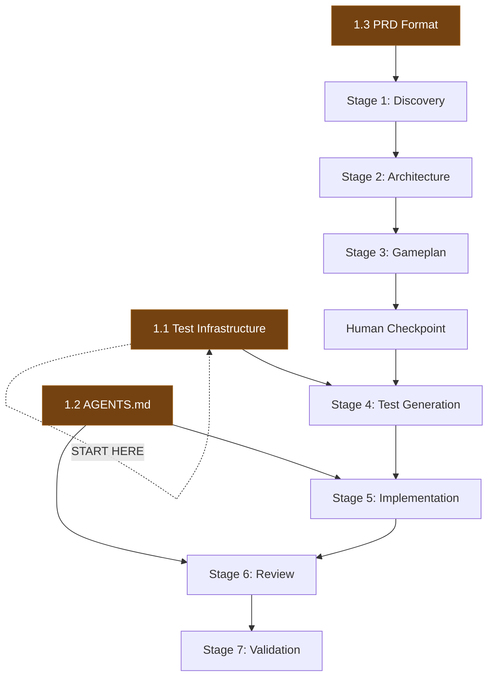

# Gap Analysis: What's Missing

> **Purpose:** Identifies what must exist before the pipeline can function, prioritized by leverage and dependency order.

---

## The Core Insight

From the constraint analysis:

> **Before agents:** Bottleneck was "can we build it fast enough?"
> **After agents:** Bottleneck is "do we know what to build?"

The pipeline shifts the constraint from execution to clarity. Everything in this gap analysis serves one goal: **making requirements clear enough that agents can execute them correctly.**

---

## Priority 1: Foundations (Must Have Before Anything Works)

### 1.1 Automated Test Infrastructure

**Status:** Minimal. Heavy reliance on manual QA.
**Why it blocks everything:** Without automated tests, Stages 4-7 don't work. The pipeline has no verification mechanism.

**What's needed:**
- [ ] Rails: RSpec test suite that runs reliably in CI
  - Model specs for core models
  - Request specs for API endpoints
  - System specs for critical admin workflows
- [ ] iOS: XCTest suite that runs in CI
- [ ] Android: JUnit + Espresso suite that runs in CI
- [ ] CI pipeline that gates on test suite (PRs can't merge with failing tests)
- [ ] Baseline test coverage on existing features (agents need examples to follow)

**Leverage:** Highest. This is the single biggest unlock. Everything downstream depends on it.

**Approach:**
- Start with Rails API request specs (highest value per test)
- Have agents write tests for existing endpoints as a bootstrap exercise
- Build up coverage incrementally, not all-at-once

### 1.2 AGENTS.md Per Repository

**Status:** May exist partially. Needs to be comprehensive.
**Why it blocks everything:** Without documented conventions, agents improvise. Code quality becomes inconsistent.

**What's needed per repo:**
- [ ] Code style and patterns (naming, file organization, architecture patterns)
- [ ] Security conventions (scoping patterns, authorization approach)
- [ ] Testing conventions (how to write tests, what to test, test file organization)
- [ ] API conventions (serializer patterns, response format, error handling)
- [ ] Data model conventions (UUIDv7, timestamps, naming, migration patterns)
- [ ] PR conventions (size, naming, description format)
- [ ] Platform-specific patterns (Rails: service objects vs concerns; iOS: MVVM vs MVC; Android: architecture)

**Leverage:** Very high. This is what turns agent output from "generic code" to "OrangeQC code."

### 1.3 PRDs in Structured Markdown

**Status:** PRDs likely exist in Google Docs or similar.
**Why it blocks everything:** Agents need machine-readable input. The pipeline starts with a PRD file.

**What's needed:**
- [ ] PRD intake template (see `templates/prd-intake.md`)
- [ ] Process for converting existing PRDs to structured markdown
- [ ] Or: agent that converts Google Doc PRDs to structured markdown (Stage 0)
- [ ] PRDs stored in a repo or accessible location

**Leverage:** High. This is the pipeline's input format.

---

## Priority 2: Pipeline Infrastructure (Needed to Orchestrate)

### 2.1 Orchestration Layer

**Status:** Does not exist.
**Why it matters:** Something needs to chain stages, manage state, and insert human checkpoints.

**Options (evaluate):**
| Option | Pros | Cons |
|--------|------|------|
| Claude Code custom commands | Lowest friction, already in use | Manual orchestration, no state management |
| Claude Agent SDK | Programmatic, composable, state management | Requires building, new dependency |
| Simple shell scripts | Dead simple, transparent | Limited error handling, brittle |
| GitHub Actions workflow | Built-in CI/CD, event-driven | Opinionated, may not fit all stages |

**Recommendation:** Start with Claude Code custom commands for prototyping individual stages. Move to Agent SDK when you need automated stage-chaining.

### 2.2 Linear Integration

**Status:** Linear is in use. MCP tools available.
**Why it matters:** Linear is the coordination layer. Pipeline state should be visible there.

**What's needed:**
- [ ] Template for pipeline-created Linear issues
- [ ] Status mapping (pipeline stage → Linear status)
- [ ] Linking convention (PRD issue → milestone tickets → PR links)
- [ ] Automated ticket creation from gameplan milestones

### 2.3 Cross-Repo Agent Access

**Status:** Agents operate in single repos currently.
**Why it matters:** Discovery and architecture stages need to read multiple repos (Rails, iOS, Android) to understand the full picture.

**What's needed:**
- [ ] Agent can access Rails, iOS, and Android repos
- [ ] Conventions for referencing cross-repo patterns
- [ ] Shared artifacts location (architecture proposal, API payloads)

---

## Priority 3: Stage-Specific Gaps

### 3.1 Discovery Stage Gaps
- [ ] No standardized "discovery report" format (template needed)
- [ ] No automated way to map "PRD concept" → "existing code locations"
- [ ] Need few-shot examples of good discovery reports

### 3.2 Architecture Stage Gaps
- [ ] No codified data model conventions beyond gameplan template
- [ ] Example payloads from past features not collected (needed as few-shot examples)
- [ ] Backwards compatibility matrix pattern not templated
- [ ] Migration planning conventions not documented

### 3.3 Gameplan Stage Gaps
- [ ] Gameplan template exists but needs refinement for agent use
- [ ] Acceptance criteria extraction from PRDs is currently ad-hoc
- [ ] Milestone sizing heuristics not documented

### 3.4 Test Generation Stage Gaps
- [ ] **Test infrastructure** (see 1.1 - this is the critical gap)
- [ ] Few-shot test examples needed per platform
- [ ] Test naming and organization conventions not documented
- [ ] No mapping from "acceptance criterion" → "test type"

### 3.5 Implementation Stage Gaps
- [ ] Per-milestone implementation prompts not templated
- [ ] Branch naming conventions for agent-created branches
- [ ] PR template for agent-created PRs
- [ ] Convention for agent commit messages

### 3.6 Review Stage Gaps
- [ ] Review criteria not formalized beyond AGENTS.md
- [ ] No automated way to check cross-platform payload consistency
- [ ] Escalation criteria (when does review escalate to human?) not defined

### 3.7 Validation Stage Gaps
- [ ] QA readiness report format not defined (template needed)
- [ ] No automated acceptance criteria → test coverage mapping
- [ ] Feature flag validation not automated

---

## Priority 4: Quality of Life (Nice to Have, High Impact Over Time)

### 4.1 Few-Shot Example Library
- Collect good examples of each pipeline artifact (discovery reports, architecture proposals, gameplans, tests)
- These become the training data that makes agent output better over time
- Start collecting from the Line Items & Sections project

### 4.2 Pipeline Metrics
- Track time-per-stage
- Track human review turnaround time (the actual bottleneck)
- Track rework rate (how often does review send back to implementation?)
- Track acceptance criteria coverage

### 4.3 Feedback Loop
- Code review comments that recur → update AGENTS.md → pipeline improves
- Test failures that reveal spec gaps → improve gameplan stage
- QA findings that should have been caught → improve test generation stage

---

## Implementation Sequence

**Do these first (in parallel):**
1. Test infrastructure (1.1)
2. AGENTS.md per repo (1.2)
3. PRD intake format (1.3)

**Then prototype stages left to right:**
1. Discovery → Architecture → Gameplan (Stages 1-3)
2. Test Generation (Stage 4)
3. Implementation (Stage 5)
4. Review + Validation (Stages 6-7)

**Each stage can be prototyped independently** by providing manual input. You don't need the full pipeline to test one stage.
