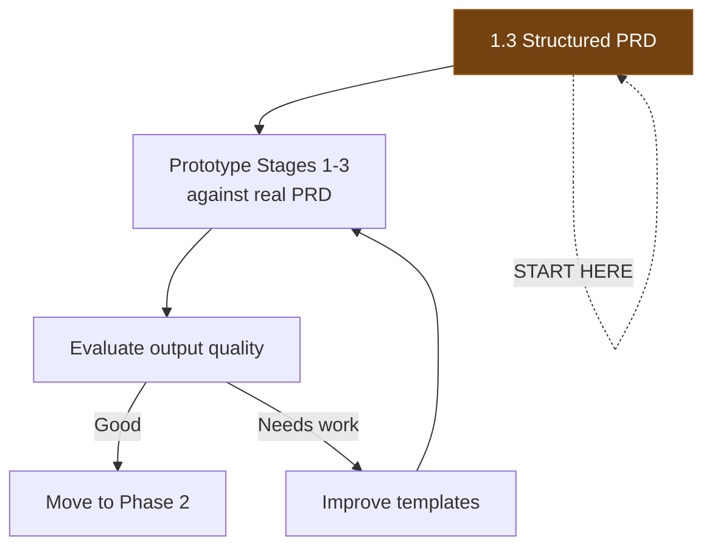

# Gap Analysis: What's Missing

> **Purpose:** Identifies what must exist before the pipeline can function, prioritized by leverage and dependency order.

---

## The Core Insight

From the constraint analysis:

> **Before agents:** Bottleneck was "can we build it fast enough?"
> **After agents:** Bottleneck is "do we know what to build?"

The pipeline shifts the constraint from execution to clarity. Everything in this gap analysis serves one goal: **making requirements clear enough that agents can execute them correctly.**

---

## Priority 1: Foundations (Must Have Before Anything Works)

### 1.1 Automated Test Infrastructure

**Rails Status:** In place and improving. RSpec test suite runs in CI. Coverage is growing — model specs, request specs, and system specs exist and are being expanded. Sufficient to support pipeline Stages 4-7 for Rails-only projects.

**iOS Status:** Behind but developing rapidly. Test infrastructure is not yet at the level needed for pipeline use.

**Android Status:** Behind but developing rapidly. Test infrastructure is not yet at the level needed for pipeline use.

**What's needed:**
- [x] Rails: RSpec test suite that runs reliably in CI
- [ ] Rails: Continue expanding baseline coverage (agents need examples to follow)
- [ ] iOS: XCTest suite that runs in CI (deferred — not blocking initial pipeline use)
- [ ] Android: JUnit + Espresso suite that runs in CI (deferred — not blocking initial pipeline use)
- [x] CI pipeline that gates on test suite (PRs can't merge with failing tests)

**Leverage:** Highest. Rails test infra is the single biggest unlock and it's ready. iOS/Android will follow as those test suites mature.

**Approach:**
- ~~Start with Rails API request specs (highest value per test)~~ Done.
- Continue expanding Rails coverage incrementally — agents need examples to follow
- iOS and Android test infra will be addressed when the pipeline expands to mobile

### 1.2 AGENTS.md Per Repository

**Rails Status:** Exists and is comprehensive. Covers code style, security scoping, testing conventions, database conventions (including table tiers and production snapshot), serialization patterns, API versioning, and frontend conventions. Ready for pipeline use.

**API Documentation Status:** Exists at `~/projects/orangeqc/apiv4/`. Contains full endpoint specs with request/response JSON, authentication mechanism, error format, pagination patterns, and sync patterns. Ready for pipeline use.

**What's needed per repo:**
- [x] **Rails:** AGENTS.md — comprehensive, covers all pipeline-critical conventions
- [x] **API docs:** Endpoint documentation with examples, error format, auth mechanism, pagination
- [ ] iOS (deferred): AGENTS.md for iOS conventions — address when pipeline expands to mobile
- [ ] Android (deferred): AGENTS.md for Android conventions — address when pipeline expands to mobile

**See:** `docs/orangeqc-constraints.md` → "Reference Materials for Pipeline Agents" for details on what each resource contains and which pipeline stages use it.

**Leverage:** Very high. This is what turns agent output from "generic code" to "OrangeQC code."

### 1.3 PRDs in Structured Markdown

**Status:** PRDs likely exist in Google Docs or similar.
**Why it blocks everything:** Agents need machine-readable input. The pipeline starts with a PRD file.

**What's needed:**
- [ ] PRD intake template (see `templates/prd-intake.md`)
- [ ] Process for converting existing PRDs to structured markdown
- [ ] Or: agent that converts Google Doc PRDs to structured markdown (Stage 0)
- [ ] PRDs stored in a repo or accessible location

**Leverage:** High. This is the pipeline's input format.

---

## Priority 2: Pipeline Infrastructure (Needed to Orchestrate)

### 2.1 Orchestration Layer

**Status:** Does not exist.
**Why it matters:** Something needs to chain stages, manage state, and insert human checkpoints.

**Options (evaluate):**
| Option | Pros | Cons |
|--------|------|------|
| Claude Code custom commands | Lowest friction, already in use | Manual orchestration, no state management |
| Claude Agent SDK | Programmatic, composable, state management | Requires building, new dependency |
| Simple shell scripts | Dead simple, transparent | Limited error handling, brittle |
| GitHub Actions workflow | Built-in CI/CD, event-driven | Opinionated, may not fit all stages |

**Recommendation:** Start with Claude Code custom commands for prototyping individual stages. Move to Agent SDK when you need automated stage-chaining.

### 2.2 Linear Integration

**Status:** Linear is in use. MCP tools available.
**Why it matters:** Linear is the coordination layer. Pipeline state should be visible there.

**What's needed:**
- [ ] Template for pipeline-created Linear issues
- [ ] Status mapping (pipeline stage → Linear status)
- [ ] Linking convention (PRD issue → milestone tickets → PR links)
- [ ] Automated ticket creation from gameplan milestones

### 2.3 Cross-Repo Agent Access

**Status:** Agents operate in single repos currently.
**Why it matters:** Discovery and architecture stages need to read multiple repos (Rails, iOS, Android) to understand the full picture.
**Note:** For Rails-only projects, single-repo access is sufficient. Cross-repo access becomes critical when the pipeline expands to mobile.

**What's needed:**
- [ ] Agent can access Rails, iOS, and Android repos
- [ ] Conventions for referencing cross-repo patterns
- [ ] Shared artifacts location (architecture proposal, API payloads)

---

## Priority 3: Stage-Specific Gaps

### 3.1 Discovery Stage Gaps
- [ ] No standardized "discovery report" format (template needed)
- [ ] No automated way to map "PRD concept" → "existing code locations"
- [ ] Need few-shot examples of good discovery reports

### 3.2 Architecture Stage Gaps
- [ ] No codified data model conventions beyond gameplan template
- [ ] Example payloads from past features not collected (needed as few-shot examples)
- [ ] Backwards compatibility matrix pattern not templated
- [ ] Migration planning conventions not documented

### 3.3 Gameplan Stage Gaps
- [ ] Gameplan template exists but needs refinement for agent use
- [ ] Acceptance criteria extraction from PRDs is currently ad-hoc
- [ ] Milestone sizing heuristics not documented

### 3.4 Test Generation Stage Gaps
- [ ] **Test infrastructure** (see 1.1 - this is the critical gap)
- [ ] Few-shot test examples needed per platform
- [ ] Test naming and organization conventions not documented
- [ ] No mapping from "acceptance criterion" → "test type"

### 3.5 Implementation Stage Gaps
- [ ] Per-milestone implementation prompts not templated
- [ ] Branch naming conventions for agent-created branches
- [ ] PR template for agent-created PRs
- [ ] Convention for agent commit messages

### 3.6 Review Stage Gaps
- [ ] Review criteria not formalized beyond AGENTS.md
- [ ] No automated way to check cross-platform payload consistency
- [ ] Escalation criteria (when does review escalate to human?) not defined

### 3.7 Validation Stage Gaps
- [ ] QA readiness report format not defined (template needed)
- [ ] No automated acceptance criteria → test coverage mapping
- [ ] Feature flag validation not automated

---

## Priority 4: Quality of Life (Nice to Have, High Impact Over Time)

### 4.1 Few-Shot Example Library
- Collect good examples of each pipeline artifact (discovery reports, architecture proposals, gameplans, tests)
- These become the training data that makes agent output better over time
- Start collecting from the Line Items & Sections project

### 4.2 Pipeline Metrics
- Track time-per-stage
- Track human review turnaround time (the actual bottleneck)
- Track rework rate (how often does review send back to implementation?)
- Track acceptance criteria coverage

### 4.3 Feedback Loop
- Code review comments that recur → update AGENTS.md → pipeline improves
- Test failures that reveal spec gaps → improve gameplan stage
- QA findings that should have been caught → improve test generation stage

---

## Implementation Sequence

### Phased Rollout: Rails First, Mobile Later

The pipeline launches with **Rails-only projects**. Rails test infrastructure is in place, and Rails capacity is the team's biggest bottleneck (Dave is effectively the only full-time Rails dev). iOS and Android test infrastructure is developing rapidly but isn't ready for pipeline use yet.

This means:
- Stages 1-3 focus on Rails data model, API endpoints, and admin UI (no mobile tasks yet)
- Stages 4-7 generate and verify Rails code only
- Mobile stages will be added when iOS/Android test suites mature
- The architecture proposal still designs the API contract that mobile will eventually build against — we don't skip API design, we just defer mobile implementation

### Phase 1: Foundation (Now)

**Foundations (done):**
1. ~~Test infrastructure for Rails~~ — Done. Continue expanding coverage.
2. ~~AGENTS.md for Rails repo~~ — Done. Comprehensive.
3. ~~API documentation~~ — Done. Full endpoint docs at `~/projects/orangeqc/apiv4/`.

**Do now:**
4. Convert one real PRD to structured markdown format
5. Prototype Stages 1-3 (Discovery → Architecture → Gameplan) against the real PRD
6. Evaluate output — does it produce a spec you'd actually build from?

### Phase 2: Code Generation (Rails Only)

Once Stages 1-3 produce good output:
1. Prototype Stage 4 (Test Generation) — write failing Rails tests from the approved spec
2. Prototype Stage 5 (Implementation) — make the tests pass
3. Prototype Stages 6-7 (Review + Validation) — review and verify

### Phase 3: Orchestration

Once individual stages work well when run manually:
1. Build orchestration layer (Claude Code custom commands → Agent SDK)
2. Wire up Linear integration (automated ticket creation, status transitions)
3. Run a complete end-to-end pipeline on a real Rails project

### Phase 4: Mobile Expansion

When iOS/Android test infrastructure is ready:
1. AGENTS.md for iOS and Android repos
2. Expand Stages 1-3 to include mobile platform tasks
3. Expand Stages 4-7 to generate and verify mobile code
4. Enable cross-repo agent access

**Each stage can still be prototyped independently** by providing manual input. You don't need the full pipeline to test one stage.
