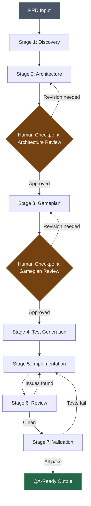

# Pipeline Architecture

> **Purpose:** The complete design of the 7-stage agent pipeline from PRD intake to QA-ready code.

---

## Overview



---

## Pipeline Stages

### Stage 1: Discovery
**Agent Type:** Codebase explorer
**Input:** PRD (structured markdown)
**Output:** Discovery Report

The discovery agent explores the existing codebase to understand how things work TODAY before proposing how they should work TOMORROW. This implements the M0 Discovery principle.

- Searches for related models, controllers, serializers, tests, and API endpoints
- Documents current data model for affected entities
- Identifies existing patterns the new feature should follow
- Maps existing API endpoints and their payloads
- Flags technical risks and unknowns
- Surfaces code that will need modification

**See:** `docs/stages/01-discovery.md` for full specification

---

### Stage 2: Architecture
**Agent Type:** Technical designer
**Input:** PRD + Discovery Report
**Output:** Architecture Proposal

The architecture agent proposes the technical design: data model changes, API endpoints, migrations, and cross-platform contracts.

- Proposes data model (new tables, columns, indexes, migrations)
- Designs API endpoints with full example request/response JSON
- Plans serializers and data transformations
- Generates backwards compatibility matrix
- Identifies migration strategy (DDL, concurrent indexes, backfills)

**See:** `docs/stages/02-architecture.md` for full specification

---

### Human Checkpoint: Architecture Review

**This is non-negotiable.**

The architecture proposal must be reviewed and approved before the gameplan is generated. The data model and API contract are the foundation everything else builds on — getting them wrong is expensive to fix later.

The human reviewer (tech lead / CTO) checks:

#### Must Approve
- [ ] Data model is architecturally sound (tables, columns, relationships, constraints)
- [ ] API design is consistent with existing patterns (envelopes, error format, pagination)
- [ ] Backwards compatibility is handled correctly (compatibility matrix filled out)
- [ ] Security scoping is correct (all queries scoped to account, authorization checked)
- [ ] Migration strategy is safe (concurrent indexes, backfill approach)

#### Should Check
- [ ] Serializer design matches existing conventions (Blueprinter for new code)
- [ ] Export impact is addressed
- [ ] Open questions are answerable (not punting critical decisions)
- [ ] API payloads are complete enough that a mobile engineer could build against them
- [ ] Nothing is missed that the agent wouldn't know about (upcoming related changes, in-progress work)

#### Approval Outcomes
1. **Approved** → Stage 3 (Gameplan) begins
2. **Approved with modifications** → Agent incorporates feedback, re-generates affected sections
3. **Rejected** → Returns to Stage 2 (design issues) or Stage 1 (fundamental misunderstanding)

**Linear:** Architecture review is tracked as a Linear issue. Approval transitions the project to "Architecture Approved" status.

---

### Stage 3: Gameplan
**Agent Type:** Project planner
**Input:** PRD + Discovery Report + **Approved** Architecture Proposal
**Output:** Engineering Gameplan (Spec)

The gameplan agent produces a complete engineering spec following the gameplan template. This is the document the team builds against.

- Breaks PRD into functional milestones (by feature area, not platform)
- Generates acceptance criteria per milestone
- Maps platform-specific tasks within each milestone
- Fills non-functional requirements checklist
- Identifies dependencies between milestones
- Creates Linear tickets for each milestone

**See:** `docs/stages/03-gameplan.md` for full specification

---

### Human Checkpoint: Gameplan Review

**This is non-negotiable.**

Before any code is generated, a human (tech lead / CTO) reviews and approves the gameplan. The architecture has already been approved — this review focuses on the implementation plan.

The human reviewer checks:

#### Must Approve
- [ ] Milestones are properly scoped and sequenced
- [ ] Acceptance criteria are correct and complete
- [ ] Every PRD requirement is traceable to a milestone
- [ ] Platform tasks are realistic and well-defined

#### Should Check
- [ ] Nothing is missed that the agent wouldn't know about
  - Political context ("Matt wants it done this way")
  - Customer promises or commitments
  - In-progress work on other branches
  - Upcoming related changes
- [ ] Estimates feel reasonable
- [ ] Release plan makes sense for the business
- [ ] Gameplan is consistent with the approved architecture (no contradictions or drift)

#### Approval Outcomes
1. **Approved** → Stage 4 begins, Linear milestone tickets created
2. **Approved with modifications** → Agent incorporates feedback, re-generates affected sections
3. **Rejected** → Returns to Stage 3 (gameplan issues) or Stage 2 (architecture needs revisiting)

**Why:** Agents are bad at product judgment, political context, and knowing about undocumented in-progress work. This checkpoint catches what agents miss.

**Linear:** Gameplan approval is tracked as a Linear issue. Approval transitions the project to "Building" status and creates milestone tickets.

---

### Stage 4: Test Generation
**Agent Type:** Test writer
**Input:** Approved Spec + Acceptance Criteria
**Output:** Failing Test Suites (TDD)

The test generation agent writes comprehensive test suites from the approved spec. Tests are written BEFORE implementation (TDD).

- Model/unit tests from data model design
- Request/API tests from endpoint designs + example payloads
- System/E2E tests from user flows in the PRD
- Tests organized by milestone
- Tests follow existing test patterns in each repo

**Platform-specific test types:**
| Platform | Test Framework | Types |
|----------|---------------|-------|
| Rails | RSpec | Model specs, request specs, system specs |
| iOS | XCTest | Unit tests, integration tests |
| Android | JUnit + Espresso | Unit tests, integration tests, UI tests |

**See:** `docs/stages/04-test-generation.md` for full specification

---

### Stage 5: Implementation
**Agent Type:** Code builder (per platform)
**Input:** Spec + Failing Tests (per milestone)
**Output:** Implementation code + Passing tests

The implementation agent works milestone-by-milestone, writing code to make the failing tests pass.

- Works in order: **Rails API first**, then iOS, then Android
- Creates PRs per milestone (not one giant PR)
- Follows `AGENTS.md` conventions per repo
- Rails API must be deployed (to staging) before mobile begins
- Each PR includes the relevant tests from Stage 4

**See:** `docs/stages/05-implementation.md` for full specification

---

### Stage 6: Review
**Agent Type:** Code reviewer
**Input:** PR diff + AGENTS.md + Spec
**Output:** Review feedback (approve or request changes)

The review agent examines each PR against conventions, security requirements, and the spec.

- Checks code against `AGENTS.md` conventions
- Validates security (scoped queries, authorization, no XSS/injection)
- Verifies consistency with the approved spec
- Checks cross-platform payload compatibility
- Validates test coverage against acceptance criteria
- Flags deviations from architecture proposal

**Loop:** If issues found, returns to Stage 5 for fixes. This loop is automated for convention/style issues. Architectural concerns escalate to human review.

**See:** `docs/stages/06-review.md` for full specification

---

### Stage 7: Validation
**Agent Type:** Quality validator
**Input:** Reviewed code (all milestone PRs)
**Output:** QA Readiness Report

The validation agent runs the full test suite and produces a QA readiness report.

- Runs complete test suite (unit + integration + E2E)
- Validates all acceptance criteria are covered by passing tests
- Checks feature flag configuration
- Verifies backwards compatibility (old API versions still work)
- Produces QA readiness report with manual testing guidance
- Updates Linear issues with final status

**See:** `docs/stages/07-validation.md` for full specification

---

## Cross-Cutting Concerns

### Linear Integration

Linear is the coordination layer throughout the pipeline:

| Event | Linear Action |
|-------|--------------|
| Pipeline starts | Create project, link to PRD |
| Discovery complete | Update project with findings |
| Architecture proposed | Create architecture review issue |
| Architecture approved | Update project status to "Architecture Approved" |
| Gameplan proposed | Create gameplan review issue |
| Gameplan approved | Create milestone tickets, status → "Building" |
| Tests generated | Link test PRs to milestone tickets |
| Implementation complete | Update milestone ticket status |
| Review passes | Transition tickets to "In Review" |
| Validation passes | Transition tickets to "Ready for QA" |

### Platform Execution Order

```
1. Rails API (backend)
   ↓ (deploy to staging)
2. iOS (mobile)
   ↓ (parallel with Android where possible)
3. Android (mobile)
```

Mobile depends on API. Backend deploys first. Mobile validates against live staging API.

### Shared Contracts

The Architecture Proposal (Stage 2) produces shared contracts that all platforms build against:
- **Data model** - Schema, migrations, relationships
- **API payloads** - Example request/response JSON for every endpoint
- **Compatibility matrix** - What each app version sees

These contracts are the single source of truth. If a platform discovers the contract is wrong, the contract is updated (not worked around).

### Error Handling & Recovery

| Failure | Response |
|---------|----------|
| Discovery finds no related code | Flag as greenfield; architecture agent adjusts approach |
| Architecture conflicts with existing patterns | Include conflict analysis in proposal; human checkpoint resolves |
| Gameplan can't satisfy all PRD requirements | Surface trade-offs and open questions; human resolves |
| Tests can't be written (missing test infra) | Escalate; identify what test infrastructure is needed |
| Implementation fails to make tests pass after 3 attempts | Escalate to human; likely spec or test issue |
| Review finds architectural problems | Escalate to human; don't auto-fix architecture |
| Validation reveals untested acceptance criteria | Return to Stage 4 to generate missing tests |

### Guardrails

All guardrails from the Agentic Development Guardrails policy apply:
- No production access
- No Heroku remotes
- No production deploy credentials
- CI must pass
- Human approves all merges
